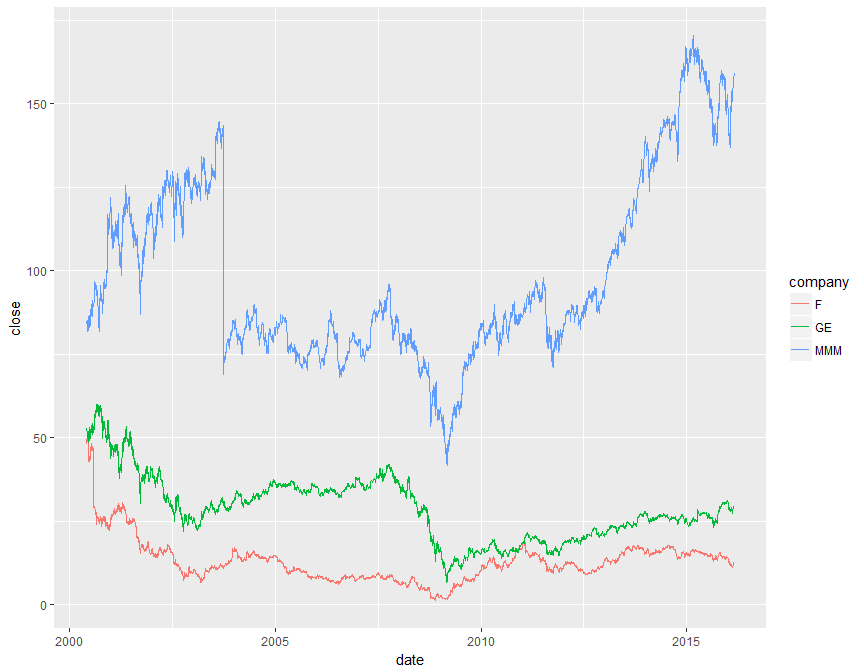
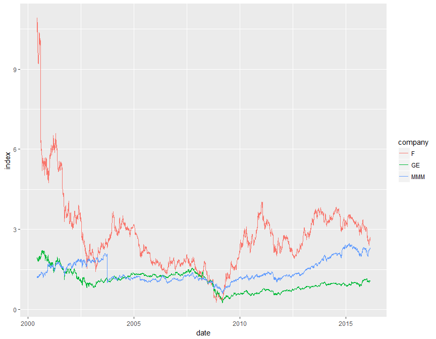

# Activity: Stocks & Dividends
Zhaohu(Jonathan) Fan  


### Getting Price Data


```r
# choose companies of interest
companies <- c("F", "MMM", "GE")

Prices <- read_stock_prices(companies, what = "daily", start_year = 2000, end_year = 2016)

# inspect data
head(Prices)
```

```
##    open  high   low close   volume adj_close company       date
## 1 12.11 12.40 12.05 12.39 32024800  11.78287       F 2016-02-25
## 2 12.11 12.11 11.60 12.08 60608400  11.48806       F 2016-02-24
## 3 12.53 12.65 12.42 12.42 30136700  11.81139       F 2016-02-23
## 4 12.10 12.56 12.10 12.56 33549700  11.94454       F 2016-02-22
## 5 12.19 12.22 12.01 12.10 26479300  11.50708       F 2016-02-19
## 6 12.40 12.44 12.12 12.26 28784700  11.65924       F 2016-02-18
```

```r
# chart close vs date for each company
Prices %>%
  ggplot(aes(x = date, y = close)) + 
  geom_line(aes(color = company))
```

<!-- -->


### Buy/Sell Profit


```r
Actions <- 
  data.frame(
    action = c("buy", "sell"), 
    date = ymd(c("2008-07-14", "2015-12-16"))
  )

# Combine the Prices & Actions tables
SalesDifference <- 
  Prices %>%
  inner_join(Actions) %>%
  select(company, action, close) %>%
  spread(key = action, value = close) %>%
  mutate(profit = sell - buy)

# inspect the data table
SalesDifference
```

```
##   company   buy   sell profit
## 1       F  4.66  14.36   9.70
## 2      GE 27.18  30.98   3.80
## 3     MMM 69.02 149.95  80.93
```


### Indexing Prices


```r
# choose reference date
ref_date <- ymd("2008-07-14")

# establish reference value for indexing
Reference <- 
  Prices %>%
  filter(date == ref_date) %>%
  select(company, standard=close)  # renames close variable as "standard"

# inspect the result
Reference
```

```
##   company standard
## 1       F     4.66
## 2     MMM    69.02
## 3      GE    27.18
```

```r
# index against reference value
IndexData <- 
  Prices %>%
  left_join(Reference) %>%
  transmute(company, date, index = close/standard)

# inspect the result
head(IndexData)
```

```
##   company       date    index
## 1       F 2016-02-25 2.658798
## 2       F 2016-02-24 2.592275
## 3       F 2016-02-23 2.665236
## 4       F 2016-02-22 2.695279
## 5       F 2016-02-19 2.596567
## 6       F 2016-02-18 2.630901
```

```r
# graph the indexes
IndexData %>%
  ggplot(aes(x = date, y = index)) + 
  geom_line(aes(color = company))
```

<!-- -->


### Dividends

 Note that some companies don't issue dividends, so it must be removed or replaced before continuing.


```r
# read dividend data
Dividends <- read_stock_prices(companies, what = "dividends")

# inspect the data
head(Dividends)

DividendsEarned <- 
  Prices %>%
  inner_join(Dividends) %>%
  filter(ymd(date) <= ymd("2015-12-16"), ymd(date) >= ymd("2008-07-14")) %>%
  select(company, dividends) %>%
  group_by(company) %>%
  summarise(totalDividends = sum(dividends))

# inspect the result
head(DividendsEarned)
```


```r
# earnings comparison
SalesDifference %>%
  inner_join(DividendsEarned)
```

